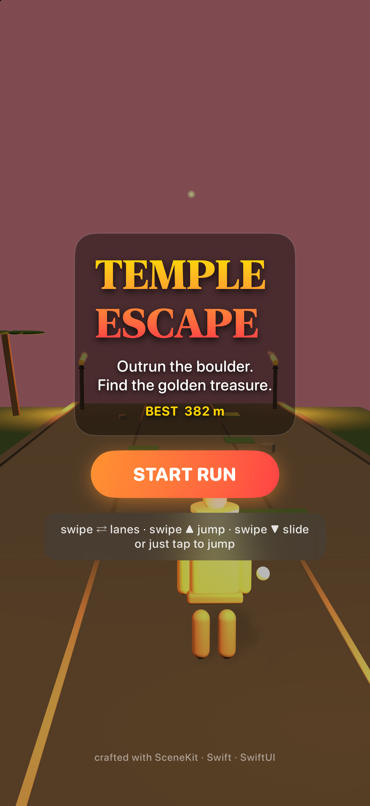
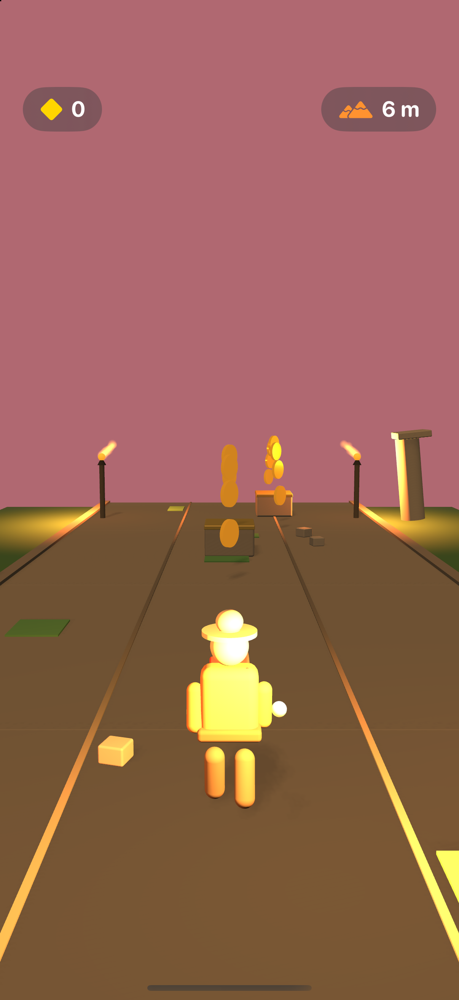
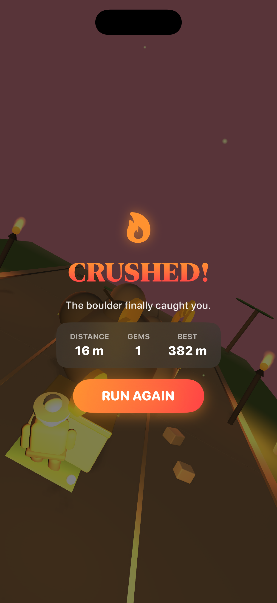
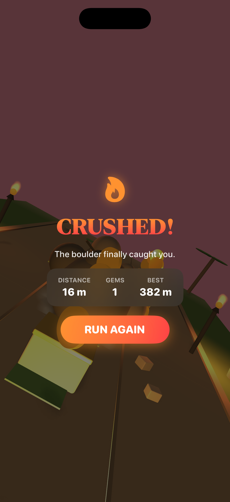

# Temple Escape 🏃

A 3D endless runner for iOS, built with Swift + SceneKit + SwiftUI. You're an explorer sprinting through a lost jungle temple while a giant boulder is right on your heels.

Everything in the world — the ruins, palms, torches, the runner, the boulder — is generated procedurally at runtime from basic SceneKit primitives. No assets, no downloads, just code.






## How to play

| Gesture | Action |
| --- | --- |
| Swipe left / right | Change lane |
| Swipe up (or tap) | Jump |
| Swipe down | Slide |
| Swipe down mid-air | Fast-fall |

Three lanes, endless track. Dodge the pillars, jump the stone blocks, slide under the lintels, grab the coins, and don't let the boulder catch you. The track gets faster the further you run, and the boulder keeps closing in.

## Notes

- The jump is integrated manually (kinematic, no physics-engine dependency) so it always feels the same, frame rate or thread timing aside.
- Only the two torches nearest the runner cast light — keeps the scene cheap.
- Particles use a generated soft sprite instead of SceneKit's default squares.
- Best score is saved with `UserDefaults`.
- `-autostart` skips the menu (handy for testing); `-debugcoins` drops a coin line right ahead of the runner.

## Build & run

```bash
xcodebuild -project TempleEscape.xcodeproj -scheme TempleEscape \
  -destination 'platform=iOS Simulator,name=iPhone 17' build
```

Or just open the project in Xcode and hit Run. Requires Xcode 15+, iOS 17+.

## Tests

`xcodebuild test -project TempleEscape.xcodeproj -scheme TempleEscape -destination 'platform=iOS Simulator,name=iPhone 17'`

Unit tests cover the gameplay rules (speed curve, boulder behavior, jump trajectory); UI tests cover the menu → run → game-over flow, the swipe-up jump, and coin pickup.
